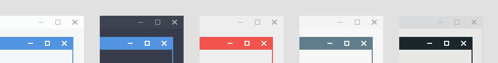
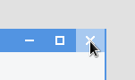
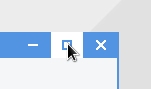

# About
Pixa is a minimal theme for xfwm, the default window manager for the Xfce desktop. It the primary active colour of your current GTK theme for the active window colour, and the primary inactive colour for inactive windows. Remaining colours are relatively theme-neutral, and allow for a wide range of appearances depending on your theme:

**Button Hover:**

**Button Click:**

